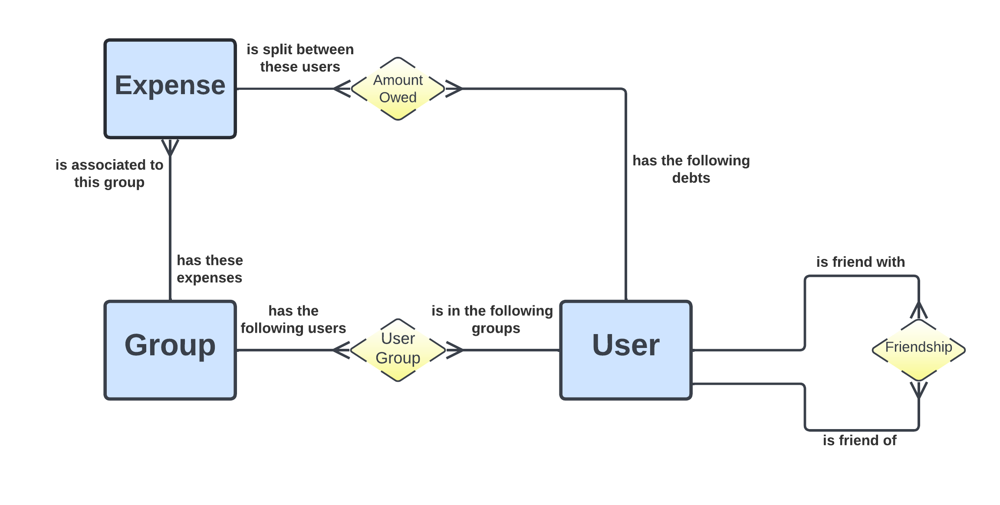

# Split_IT
Collaborators:
@andreicosmin55
@alexandravoinea01
## Implementation
A web application that keeps track of funds spending and bills splitting within a group of users, having an ASP.NET backend and Angular frontend

### [FRONTEND REPOSITORY](https://github.com/alexandravoinea01/Split-IT-Frontend)

[Application DEMO](https://www.youtube.com/)

The API uses an SQL SERVER database modeled by the following diagram:

## The software development process

- [x] >10 [user stories](https://trello.com/b/Xs0KtSKs/backlog)
- [x] [Backlog](https://trello.com/b/Xs0KtSKs/backlog) creation,   [Backlog history](https://github.com/LaurOp)
- [ ] [UML](/UML.png) diagram

- [ ] Source control: [Branching](https://github.com/LaurOp),  [Merging](https://github.com/LaurOp),  [Pull requests](https://github.com/LaurOp),  [Solving conflicts](https://github.com/LaurOp),  [Commiting](https://github.com/LaurOp)
- [x] [Unit Tests](/UnitTests) -> created using xUnit nuget package
- [x] [Manual testing](https://app.qase.io/project/SPLITIT?suite=1) scenarios documented 
- [x] [Bug reports](https://app.qase.io/defect/SPLITIT)
- [x] Build tool : Our backend application was built by the Visual Studio default MSBuild tool, and the unit tests sub-project was created by following [this tutorial](https://github.com/LaurOp)  that uses dotnet.exe powershell build tool
- [ ] Refactoring
- [x] Followed the [Microsoft C# Code standards](https://docs.microsoft.com/en-us/dotnet/csharp/fundamentals/coding-style/coding-conventions)
- [x] As a design pattern for [our backend](https://github.com/LaurOp/Split_IT/tree/master/Repositories) we chose the [Repository pattern](https://docs.microsoft.com/en-us/dotnet/architecture/microservices/microservice-ddd-cqrs-patterns/media/infrastructure-persistence-layer-design/repository-aggregate-database-table-relationships.png)
